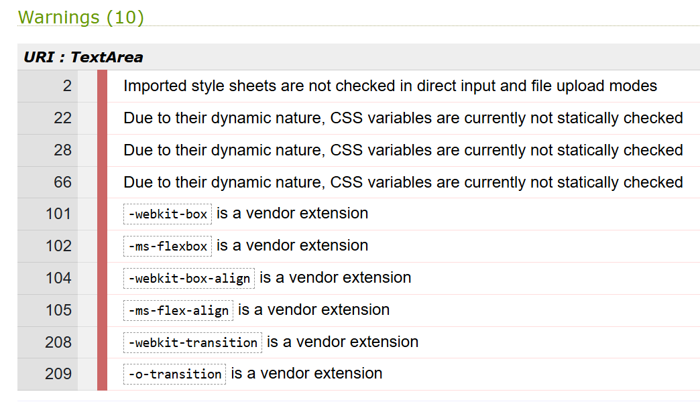

# Sotis life coach

Sotis is a life coach, and this is his website. The website targets people interested in getting a life coach. The website shows who Sotis is, how he works and what he offers. Visitors can read what sessions entail and how much they cost, the images give more context and they can read about what previous clients think of their sessions with Sotis. The contact information and social media links give the visitor the possibility to ask questions or look for more information about Sotis beyond his website. The visitor can book an appointment via a form on the website.

[Live link to website](https://lizzyongit.github.io/sotis-lifecoach/index.html)

## Index
- [Planning](#planning)
- [Features](#features)
- [Testing](#testing)
- [Technologies used](#technologies-used)
- [Deployment](#deployment)
- [Credits](#credits)

## Planning

### Site goals

- Inform visitors about Sotis the life coach, who he is, how he works and what he offers. 
- Give visitors practical information such as address and contact information, prices and session lengths. 
- Convince visitors to book an appointment with Sotis the life coach and provide a way to book this appointment. 
- The website aims to be responsive across all screen sizes, with user-friendly navigation and present information in a clear consistent way without overinforming. 

### User stories

#### As any user of this website, I want to:

- be able to navigate to all pages on any device and experience a user friendly website.

#### As a person interested in seeing a life coach, I want to:

-  find information about Sotis the life coach and how he works, so that I can decide if I consider booking an appointment with him.

#### As a potential client, I want to:

- find information about what Sotis can offer me, how much it would cost and where it would be, so that I can decide if I want to book an appointment with him.
- be able to contact Sotis, so that I can ask questions about anything unclear, so that I can decide if I still want to book an appointment with him.
- read reviews from previous clients, to decide if I also want to book an appointment with Sotis.
- find a way to book an appointment, so that I can do this easily on the website.

#### As a confirmed client, I want to:

- find contact information, so that I can contact Sotis about any matter regarding my appointment.

#### As a site owner, I want to:

- get word around about a special cat offering life coach services, so that I build brand awareness.
- get visitors to book an appointment, so that I grow my business and help clients.

#### Tasks to achieve user stories

- Create informative sections with background information about Sotis and according to which philosophy he works, with an image from his work environment.
- Create informative cards about the different sessions Sotis can offer the client and what these cost, how long they take and what they entail, with a suitable image, and a button to book them.
- Create a form where a client can choose a session and a date and time to book this session, along with filling in name, email, phone and a message.
- Create a testimonials section that contains a few reviews from other clients.
- Create a nav bar with navigation to **Home**, **About**, **Philosophy**, **Testimonials**, **What I offer** and **Book**.
- Create a footer with contact information, address, and social media links.
- Create a header on the home page with a quote over a hero image.

### Design

#### Wireframes

Below are my initial wireframes per page for mobile, tablet and laptop screen sizes. I used [Figma](https://www.figma.com/) to create them.

    
Page 1 - Home

  

    
Page 2 - What I offer

  

    
Page 3 - Book

  

    
Page 404 not found

  

#### Color schemes

I searched the internet for life coach websites and my mentor also instantly said I would probably use a lot of blue because it conveys calmness. I found this website that I liked: https://themewagon.github.io/Pilates/, and picked two colors from it (#55CBD2 and #C5FFF1). I entered them in [Coolors.co](https://coolors.co/) and asked for two more colors. Keeping in mind the mainly blue theme, I went with these two complementary darker colors: #173753 and #1B4353.

My main background is white, as I don't want to overdo it with a blue background. 

On the hero image, I used a neutral transparent black background with white text to not intervene with the image. 

For color contrast, the used text color-background combinations get a score of 6.36 and up according to [Coolors.co](https://coolors.co/).

#### Fonts

I went on [Google Fonts](https://fonts.google.com/) and set the filter to 'Calm'. Browsing through the results, *Montserrat Alternates* stuck out to me. I liked the 'E' being different than the other fonts. For a pairing font, I couldn't find anything on some of the font pairing sites, but when I just googled for font pairs with 'Montserrat Alternates', this blog came up (https://approval.studio/blog/how-to-combine-fonts/), where they argued for the pair *Montserrat Alternates* and *Raleway*, so I decided to go with that.

#### Logos and images

The logo with a cat and a book is from [Canva](https://www.canva.com/), from which I removed the text. In [Lunapic](https://www3.lunapic.com/editor/) I created a transparent background and changed the color to create a logo in #55CBD2 or the navigation bar, and in #173753 for the favicon. To create the favicon files, I used [RealFaviconGenerator](https://realfavicongenerator.net/).

All used images are my own.

## Features 

### Existing features

- __Navigation bar__

  - All three pages have a navigation bar with the logo, **SOTIS LIFE COACH** and **Home** linking to the index.html page, **About**, **Philosophy** and **Testimonials** linking to the corresponding sections on the index.html page, **What I offer** linking to the what-i-offer.html page and the **Book** button linking to the book.html page. The page you are currently on is lighting up for the **Home** and **What I offer** page.
  - The navigation bar allows you to easily navigate between pages and specific sections on a page. It is fixed on top of the screen which is specifically useful for mobile phone users, as the pages are longer there, so the navigation is always easily reached.

- __The landing page image__

  - The landing page has a hero image of Sotis, looking into the camera, a header *Sotis life coach* with an appropriate quote about cats and life. This section hopes to grasp the user's attention and give a positive feeling.
  - My initial hero image would be with the **About** section on top, but I decided to focus on the life coach himself, Sotis, in the hero image, with a one liner on it, as I've seen in several life coach website templates.

- __About section__

  - The **About** section gives an introduction to who Sotis is and his background. For a user wanting to know more about Sotis, this is important information. The insight into who he is helps deciding on whether or not to book an appointment.

- __Image with caption__

  - The image with caption between the **About** and **Philosophy** sections, where Sotis sits with a notebook, should give the user more context. For the user, it is part of gaining more information about Sotis and seeing him at work.

- __Philosophy section__

  - The **Philosophy** section gives an insight into how Sotis works and what his methods and convictions are. This gives the user more information about his professionality, what to expect,  and helps in making the decision to book an appointment or not.

- __Testimonials section__

  - The **Testimonials** section displays previous clients' testimonials about their experiences with Sotis. They are displayed in a text-based carousel, with control buttons and playing on page load. This section is important in convincing users to book an appointment, as the testimonials come from people outside and will gain trust for Sotis.

- __The footer__ 

  - The footer section includes an address, email address, phone number and links to *X*, *Facebook* and *Instagram*. The links will open in a new tab to allow easy navigation for the user. The address and contact information are important for the user to know where Sotis works, and the possibility to contact him is important to gain trust. The links to the social media are important, so the user can get more information and context outside the website, potentially also seeing how trustworthy Sotis is by checking followers and comments on social media.

- __The What I offer page__

  - The page **What I offer** has an introductory header text and displays the four different sessions you can book with Sotis in card format. Each card has an image, related to the session type, a title, description, button that links to the book.html page, and a footer with duration and fee information. This page is crucial for the user to decide if they want to book a session and if so, which session they want to book.
   
   
   Project file: what-i-offer.html

- __The Book page__

  - The **Book** page consists of an introductory header text and a form with the fields **First name**, **Last name**, **Email**, **Phone**, **Session type**, **Preferred date and time**, and a **Send** button. All fields are required to be able to submit the form. The **Book** page is crucial for the user and site owner, as it allows to book an appointment with Sotis. Clicking **Send** leads to the CI formdump https://formdump.codeinstitute.net/.

  Project file: book.html

- __The 404 page__

  - The 404.html page consists of a simple text explaining the page is not found, and a button that links to the home page, so the user can easily go there. I did not want this page to have an image as it may just slow down the loading, I wanted it to be as simple as possible.

  
  Project file: 404.html

### Features left to implement

- Video recordings (short parts) of sessions added to the page **What I offer**.
- A possibility to sign up for a newsletter, where Sotis gives life coach tips for example.
- A separate page with life coach tips.
- A more dynamic booking form that is connected to a real calendar, so that people can only book available times and don't need to wait for a manual booking confirmation, possibly also payment options.
- A testimonials section with small profile pictures, and possibly several testimonials at once for large screens.
- When you click the **Book now** button on each card on the page **What I offer**, and you arrive at the **Book** page, the equivalent session type should be selected in the form.

## Testing 

### User story testing

|   User story                                                            | How it is achieved    |
|  -----------                                                             | -----------           |
|**As any user of this website, I want to:**|
|be able to navigate to all pages on any device and experience a user friendly website|Fixed navigation bar that is always visible, responsiveness of all pages.|
|**As a person interested in seeing a life coach, I want to:**|
|find information about Sotis the life coach and how he works, so that I can decide if I consider booking an appointment with him.  |**About** and **Philosophy** sections, pictures, social media links.            |
|**As a potential client, I want to:**      |
|find information about what Sotis can offer me, how much it would cost and where it would be, so that I can decide if I want to book an appointment with him.   | **What I offer** page with all the offered sessions, address in the footer.        |
|be able to contact Sotis, so that I can ask questions about anything unclear, so that I can decide if I still want to book an appointment with him.| Contact information in the footer.        |
|read reviews from previous clients, to decide if I also want to book an appointment with Sotis.| **Testimonials** section. |
|find a way to book an appointment, so that I can do this easily on the website.| **Book** page with booking form, reached via **Book now** buttons on **What I offer** page and **Book** button in the navigation bar. |
|**As a confirmed client, I want to:**     |
find contact information, so that I can contact Sotis about any matter regarding my appointment.  | Contact information in the footer.        |
|**As a site owner, I want to:**    |
get word around about a special cat offering life coach services, so that I build brand awareness.  | The **About** and **Philosophy** sections, images, the inspiring quote, page **What I offer**, social media links.        |
 get visitors to book an appointment, so that I grow my business and help clients.| The **About**, **Philosophy** and **Testimonials** sections, images, and **What I offer** page should convice the visitors, while the buttons that link to the **Book** page, and the **Book** page form should get the visitors to actually book.      |

### Issues

I want to mention a few issues here because they were not straight-forward to fix.

#### Testimonials carousel
The biggest issue I faced is the text-based **Testimonials** carousel.

- To have the controls not overlap the text, I had to give the carousel slide a certain padidng which also had to be adapted for different screens with media queries, because for smaller screens, too much padding caused a lot of empty space and cramped text.

- Because the testimonial texts are not equally long, the blue background carousel slides had different heights for different testimonials, which I fixed with media queries with a min-height value. 

- The texts were in the top of the slide, so that didn't look good. Css vertical-align did not work, I tried to add new divs with .container, .row and .col and use align-items-center or align-self-center, but this made the carousel not work good. Playing around in dev tools, Display:inline-flex worked on some element, but since I did not understand what it actually did, I didn't go with that. Targeting all the carousel items with .carousel-item and css display:flex and align-items:center, made the carousel look disturbed and not work. Targeting the container-item class with the active class and custom css display:flex and align-items:center, worked to get the text in the middle each slide. I realised in dev tools, that when the carousel runs, the slide that is there, gets the active class. But it makes it hard to troubleshoot since it changes so quickly. Targeting only the carousel item with the active class may override some other setting since it's more specific than just targeting .carousel-item, so I guessed this is why it worked.

- Now the next issue was that in between two carousel items, before the upcoming carousel item displays correctly in the middle on the blue background, there was a white background where the upcoming text was displayed on top. To fix the background color to remain blue all the time, I added the background to the wrapper div element, which worked. 

- But the text still displayed on top of the slide inbetween two slides, so there was a little 'jump' everytime inbetween two slides. I tried som different styles of 'sliding', like 'fade', but it did not work. My thought was that I should make the upcoming slide look like the active slide, so I applied the same styles to the .carousel-inner div to get it to look like the active carousel-item, which made it look better since the upcoming text was not on top anymore, but in the middle. 

- But there was still a little jump since the padding seemed to be different, the upcoming text was wider than the text on the active slide. I tried to target the actual carousel.item class with some of the same styles as the active carousel item, but that did not look better, it went up and down again or all testimonials were on top of each other. So the little jump seemed better at this time.

- However, I could let this go and tried to fix this this again later. Dev tools helped me enormously with the carousel. Initially, I could not figure out the issue but as the slide went on and I was looking at what happened in the dev tools side panel, I suddenly noticed a class .carousel-item-next, and figured this must be the 'upcoming' slide. I tested giving that the same padding as the active slide, which resulted in the text being the same width, since both the upcoming slide and the active slide had the same padding. But, then the text was not in the vertically in the middle, so it needed to have display:flex and align-items:center as well, so it would be exactly the same as the active class. 

- I realised that when you control the carousel yourself, and go to the previous slide manually, the previous slide ofcourse still has the 'jump' and previous issues, so I found .carousel-item-prev in dev tools and targeted that class with the same styles as .coursel-item-next, which finally made the carousel work smoothly without 'jumps'.

#### Anchor links on fixed navigation bar

- The fixed navigation bar was overriding the headers after you clicked on the anchor links About, Philosophy and Testimonials. However, the solution provided in the Boardwalk games project did not work for me, since I have not used so much margin or padding between my sections as in te Boardwalk games, so there would be no place for the navbar anyway. The navbar woudl simply need ot overlap content. I did not want to add spaces just because of this navbar and decided to look for a solution. 

- I googled and found https://css-tricks.com/fixed-headers-on-page-links-and-overlapping-content-oh-my/ with the suggestion of a simple style rule for the html element: scroll-padding-top: 70px; /* height of sticky header */. I checked if this scroll-padding-top is supported by all browsers, and found that it was (https://developer.mozilla.org/en-US/docs/Web/CSS/scroll-padding-top). I applied it with my nav bar's height of 56px, and it worked.

- But I still needed to fix the issue of the nav bar not closing after clicking an anchor link, as is done in the Boardwalk games project as well. The javascript code provided there, interferred with my scroll-padding-top solution, so I needed to find another solution for closing the nav bar after clicking an anchor link. For this, I used a posted bug report on CI's Slack on October 16-22 2024. James_BC provides an html code to make the anchor links close after clicking. This HTML code did not work but I quickly found that this was because the id was not correct, so I adapted the code and it worked. James_BC even provided a css code that would fix an issue on larger screens, as the navbar menu titles seem to collapse and open again. I copied this code in my css.stylesheet under media queries, and it worked.

- However, I noticed that the navigation bar did not close when you click next to an anchor link text, even if it navigates to the link. My mentor Anonio Rodriguez found a fix for that during our mentor session, he provided a css style making the span element inside the anchor link display as a full width block, and therefore, when you click next the the link title, the navigation bar closes and navigates to the link. 

- But I saw that even if you click a bit under a link title, the navigation bar will not close even if it navigates correctly. In DevTools, I saw this had to do with a padding that is missing on the span, so the span's height was not the same as the anchor link. To fix this, I decided to give those wrapping anchor link elements a new class, and target them to not have a padding, and put the padding on the span inside them instead. This way, all the menu items have the same space between, and you can click a bit under or above a link title, and still go to the correct section while the navigation bar closes.

A small issue is that the navbar is not closing quickly, it seems to roll upp as the page navigates to the correct section, but I think this is acceptible.

### Validator testing 

- HTML
  - The [W3C validator](https://validator.w3.org) notified me along the way about trailing slashes, since I had used 'br /', a missing p tag because I had put an ol tag inside a p tag, which is not allowed. It also notified me about a section without a header, the section I wrapped around the About and Philosophy sections and the image inbetween. This section does not need a separate title, so I gave it an h2 with a visually-hidden class.

  - No warnings or errors are currently found when passing through the validator:
    -  [index.html](https://validator.w3.org/nu/?showsource=yes&doc=https%3A%2F%2Flizzyongit.github.io%2Fsotis-lifecoach%2Findex.html)

    -  [what-i-offer.html](https://validator.w3.org/nu/?showsource=yes&doc=https%3A%2F%2Flizzyongit.github.io%2Fsotis-lifecoach%2Fwhat-i-offer.html)

    -  [book.html](https://validator.w3.org/nu/?showsource=yes&doc=https%3A%2F%2Flizzyongit.github.io%2Fsotis-lifecoach%2Fbook.html)

    -  [404.html](https://validator.w3.org/nu/?showsource=yes&doc=https%3A%2F%2Flizzyongit.github.io%2Fsotis-lifecoach%2F404.html)

- CSS
  - The [(Jigsaw) validator](https://jigsaw.w3.org/css-validator) notified me along the way about an unvalid value of padding, which I missed. This was easily fixed.

  - No errors are currently found when passing through the validator:

  

  - The warnings given by the validator apply to the imported google fonts, variables and the autoprefixer additions. These are the same as the warnings for the Boardwalk Games project, and they can be ignored, as they were ignored there.

  

### Lighthouse testing

#### Index.html

Running the home page in Lighthouse resulted in 100 % for accessability and best practices, but 79 for performance:

(Later, I realised I did not include index.html in the url, so this may have caused the low score.)

An issue was to 'serve images in next-gen formats', suggesting to fix the hero image and my rounded image. I converted those to .webp images.

It also said to 'properly size images', and suggested to fix my logo and the rounded image. I made my logo file and rounded image smaller, but still made sure the original images would always be larger than they actually will be displayed, as I don't want the risk of the images getting enlarged and lose quality.

I got an approvement after this to 92%, but the performance score does change from time to time, as my computer is also a bit slow.

Looking at what more I could do, it said to 'minimize main-thread work', mentioning style and lay-out. My css is not very complicated, but I changed some of my css targets to include child combinators instead of descendent combinators, as they should be faster. However, I did not make all of my targets specific, as this would make it harder to read I think, and it is not done in the walkthrough projects either. Now the result is 93%:

After redoing the html with h1 tags, see more below for what-i-offer.html, I got a much better result, but this was taken after I cleaned up my computer a bit, so it could just be my computer's performance influencing this. The red bullets in the Lighthouse report now have to do with Bootstrap, JS, Google Font, all issues I cannot fix. 

#### what-i-offer.html

Before running Lighthouse, I converted all my images to .webp files. The first result was:

Regarding accessibility on 98%, there was an issue 'Heading elements are not in a sequentially-descending order'. This is because the card titles from Bootstrap have the h5, while the descending order would be h3. I changed all these card titles to h3 with a class of h5 to have the same font size. Because of my custom css for h3, the font changed to Montserrat Alternates, which I kept.

Running Lighthouse again, resulted in 100% for accessibility, and now suddenly performance got to 95% as well.

After this, I actually went through the use of my headings on all pages, since an h1 was missing on every page. After adding h1 and redoing the html structure a bit, I run the HTML and CSS validators again and updated the results. I also got a new better result for Lighthouse on the home page, which may have to do that I took this one after my computer was cleaned up a bit.

The red bullets in the Lighthouse report now have to do with Bootstrap, JS, Google Font, all issues I cannot fix. Sometimes, it says my image for the 'Talking' session is too large, but it is already converted.

#### book.html

The first run Lighthouse report gives 98% on performance and 100% on accessibility and best practices. 

The red bullets, like for the other pages, mention CCS, JS which is related to Bootstrap, Google Fonts. It mentions to 'minimize main-thread work' again, 'Other' being the highest, but I don't see how I can fix this and I'm happy with the score.

#### 404.html

The first Lighthouse report gives 98% on performance and 100% on accessibility and best practices.

I'm happy with this score for performance, and like the other pages it mentions Bootstrap, Google Fonts, and I don't see anything I can improve.

### Manual testing

#### Form testing

I tested the form on the book.html page and you can not send the form if not all fields are filled out. Each time you try to click Send, it will give a warning message on the first field that is not filled out, and after you fill that one out and click Send again, it will show the message on the next field, and so on. For the email field, it requires an @ and an '.com' and something before @ and inbetween, 'a@a.com' works. The phone number field requires a number (however, it does let you type an 'e', but will still give an error), and all other fields are texts. The selectible option fields all show the correct options and you actively have to select one to continue.

After sending a completed form, you go to the CI formdump where you can see that the input names and values are correct.

#### Link testing

All links in the navigation bar go to the correct pages or sections. All buttons go to the correct page. The social media links in the footer go to the correct pages and open in a new tab.

#### Browser testing

I tested my website on Chrome, Edge and Firefox. For testin Safari, I used Chrome UA Spoofer.

I found one minor difference:

Firefox: regarding the Phone field in the form on book.html, you can type any letter, but you will get an error message saying you have to fill in a number. In other browsers, you can not even type anything else than a number (except for an 'e', but it will still give you an error). I find this acceptable.

#### Device testing

I checked the website in developer tools for the different dimensions. A few of my features have very different lay-outs on different screens, working as intended:
- Navigation bar: from small mobile screens to and including tablet screens, the menu links are collapsed in a hamburger menu.
- Hero image: from small mobile screens to but not including tablet screens, the header and quote move from the left center of the image, to the bottom of the image, to not overlap Sotis' head.
- About, image and Philosophy: from small mobile screens to but not including tablet screens, these sections are stacked vertically and take up the full screen width, with the headers centered. From tablet screens and up, they take up one row with three equal width columns, and the headers are left aligned.
- Testimonials: from small mobile screens up to and including 991 px width, the carousel takes the full width of the screen, from 992 px, it takes half the width of the container, but is centered in the middle of the screen.
- Footer: from small mobile screens to but not including tablet screens, the address section and email and phone section are stacked vertically and aligned to the left. From tablet size screens, these two sections are displayed next to each other in two columns, where the adress section in the left column is moved to the end/right of its own column.
- What I offer: 
  - from small mobile screens to but not including tablet screens, the four cards are stacked vertically, each at full width of the screen,
  - from tablet screen size to but not including small laptops at 992 px width, the four cards are displayed in two rows of two cards,
  - from 992 px, the cards are displayed in one row of four cards.
- Book: 
  - from small mobile screens to but not including tablet screens, the form fields are vertically stacked at full width of the screen,
  - from tablet screen size and up, the form fields are displayed in two columns next to each other.

I also checked the different web pages in http://www.responsinator.com/. I found a missing margin there for the 404.html when you turn a device horizontally. I realise I did not see this before because the section is so small, the viewport was always much larger, creating the white space around it when I centered the section with .my-auto. But turning the device creates a much smaller viewport, so the .my-auto did not create any margin around the section, and it does not look good:

I simple added .my-3 to the inner div.row to create some margin, without interfering with anything else. It looks fine now:

This change did not cause any new issue in the html validator or the Lighthouse report for this page.

I also tested on my own Huawei smartphone.

#### Favicon testing

When I ran my website in Realfavicongenerator's [favicon checker](https://realfavicongenerator.net/checker), I got several errors, it seemed like I was missing som files that Favicon.io did not generate. So I decided to replace my favicons with the ones generated by Realfavicongenerator and get a new html code. I also removed my favicon folder and moved the files to the root folder, as I read on several websites that this is recommended.

After checking my website in the favicon checker again, there were two errors left regarding the web app manifest, saying the 192x192 and 512x512 icons could not be found. I could not fix this issue, so I decided to remove the web app manifest file and images. These icons are for when a website can be installed as an app, which is not relevant at this point.

### Fixed bugs

See Issues.

### Unfixed Bugs

None

## Technologies used

### Languages

- HTML 5
- CSS 3

### Frameworks - libraries - programs used

- [Bootstrap](https://getbootstrap.com/) version 5.3
- [Figma](https://www.figma.com/) for wireframes
- Chrome DevTools for verifying responsibility and troubleshooting code
- [Gitpod](https://www.gitpod.io/) for coding
- [GitHub](https://github.com/) for version control and hosting
- [Google Fonts](https://fonts.google.com/) for my font pair
- [Fontawesome](https://fontawesome.com/) for my icons
- [TinyPNG](https://tinypng.com/) for compressing image size and converting to webp
- Windows Paint for resizing and cropping images
- Windows Photos for resizing images
- [Responsinator](http://www.responsinator.com/) for checking responsiveness
- [Canva](https://www.canva.com/) for logo
- [Lunapic](https://www3.lunapic.com/editor/) for transparent background and coloring in logo
- [RealFaviconGenerator](https://realfavicongenerator.net/) for creating favicon icons and the html code, and checking the favicon
- [Autoprefixer](https://autoprefixer.github.io/) for adding the necessary prefixes to my css stylesheet
- [Chrome UA Spoofer](https://chromewebstore.google.com/detail/user-agent-switcher-for-c/djflhoibgkdhkhhcedjiklpkjnoahfmg) to test my website on Safari

## Deployment

- The site was deployed to GitHub pages. The steps to deploy are as follows: 
  - In the GitHub repository, navigate to the Settings tab 
  - From the source section drop-down menu, select the Master Branch
  - Once the master branch has been selected, the page will be automatically refreshed with a detailed ribbon display to indicate the successful deployment. 

The live link can be found here - https://lizzyongit.github.io/sotis-lifecoach/index.html.

## Credits 

### Content 

- The quote on the hero image was taken from [Sandjest](https://sandjest.com/blogs/quotes/cat-quotes).
- All other text was written by me.
- The icons in the footer were taken from [Font Awesome](https://fontawesome.com/).

### Media

- All images are my own.

### Resources

- Bootstrap documentation [Bootstrap](https://getbootstrap.com/docs/5.3/getting-started/introduction/).
- [W3schools](https://www.w3schools.com/) for looking up semantic HTML.
- [Stackoverflow](https://stackoverflow.com/) for general code questions.
- For font pairing idea, [this blog from Approval studio](https://approval.studio/blog/how-to-combine-fonts/).
- Inspiration from CI walkthrough projects Boardwalk Games, Mei Wong portfolio and Love running.
- Inspiration from [this website template](https://themewagon.github.io/Pilates/).
- For getting a color scheme and checking the color contrast, [Coolors.co](https://coolors.co).
- [Grammarly](https://www.grammarly.com/grammar-check) spellchecker.
- [Diffchecker](https://www.diffchecker.com/text-compare/) for checking autoprefixer changes.
- Fixing the navigation bar to not overlap internal links, [this article from Css-tricks](https://css-tricks.com/fixed-headers-on-page-links-and-overlapping-content-oh-my/).
- Checking browser compatibility of a css style rule, [this page from MDN](https://developer.mozilla.org/en-US/docs/Web/CSS/scroll-padding-top).
- CI bug report Slack channel, post from James_BC on 16-22 Oct 2024, for the html and css code for fixing the navigation bar to close after clicking anchor links, with minor adjustment from me.
- Checking what I can do to improve performance, [Chrome DevTools documentation](https://developer.chrome.com/docs/lighthouse/performance/mainthread-work-breakdown/?utm_source=lighthouse&utm_medium=devtools).
- [Markdown guide](https://www.markdownguide.org/).

## Acknowledgments
- My mentor Antonio Rodriguez for tips, feedback, and fixing a bug.
