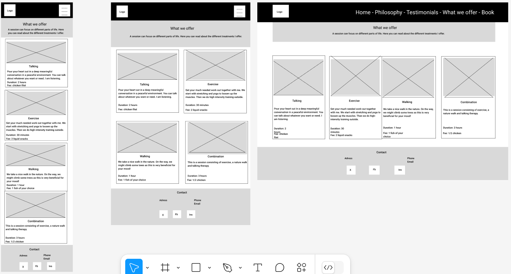

# Sotis life coach

Sotis is a life coach, and this is his website. The website targets people interested in getting a life coach. The website shows who Sotis is, how he works and what he offers. Visitors can read what sessions entail and how much they cost, the images give more context and they can read about what previous clients think of their sessions with Sotis. The contact information and social media links give the visitor the possibility to ask questions or look for more information about Sotis beyond his website. The visitor can book an appointment via a form on the website.

[Live link to website](https://lizzyongit.github.io/sotis-lifecoach/index.html)

## Planning

### Site goals

- Inform visitors about Sotis the life coach, who he is, how he works and what he offers. 
- Give visitors practical information such as address and contact information, prices and session lengths. 
- Convince visitors to book an appointment with Sotis the life coach and provide a way to book this appointment. 
- The website aims to be responsive across all screen sizes, with user-friendly navigation and present information in a clear consistent way without overinforming. 

### User stories

#### As a person interested in seeing a life coach, I want to:

-  find information about Sotis the life coach and how he works, so that I can decide if I consider booking an appointment with him.

#### As a potential client, I want to:

- find information about what Sotis can offer me, how much it would cost and where it would be, so that I can decide if I want to book an appointment with him.
- be able to contact Sotis, so that I can ask questions about anything unclear, so that I can decide if I still want to book an appointment with him.
- read reviews from previous clients, to decide if I also want to book an appointment with Sotis.
- find a way to book an appointment, so that I can do this easily on the website.

#### As a confirmed client, I want to:

- find contact information, so that I can contact Sotis about any matter regarding my appointment.

#### As a site owner, I want to:

- get word around about a special cat offering life coach services, so that I build brand awareness.
- convince visitors to book an appointment, so that I grow my business and help clients.

#### Tasks to achieve user stories (or in testing section?)

- create informative sections with background information about Sotis and according to which philosophy he works, with an image,
- create informative cards about the different sessions Sotis can offer the client and what these cost, how long they take and what they entail, with a suitable image,
- create a form where a client can choose a session and a date and time to book this session, along with filling in name, email, phone and a message,
- create a testimonials section that contains a few reviews from other clients,
- create a navbar with navigation to Home, About, Philosophy, Testimonials, What I offer and Book,
- create a footer with contact information, address, social media links,
- create a header on the Home page with a quote over a Hero image.

### Design

#### Wireframes

Below are my initial wireframes per page for mobile, tablet and laptop screen sizes. I used Figma to create them.

    
Page 1 - Home

  

    
Page 2 - What I offer

  

    
Page 3 - Book

  

    
Page 404 not found

  

#### Color schemes

I searched the internet for life coach websites and my mentor also instantly said I would probably use a lot of blue because it conveys calmness. So I found this website that I liked: https://themewagon.github.io/Pilates/, I picked two colors from it (#55CBD2 and #C5FFF1), and went to https://coolors.co/ where I entered those two colors and asked for two more colors. Keeping in mind the mainly blue theme, I went with these two complementary darker colors: #173753 and #1B4353.
My main background is white, as I don't want to overdo it with a blue background. 

On the hero image, I used a neutral transparent black background with white text to not intervene with the image. 

For color contrast, the used text color-background combinations get a score of 6.36 and up.

#### Fonts

I went on Google fonts and set the filter to "Calm", browsing through the results this one stuck out to me: Montserrat Alternates. I liked the "E" being different than the other fonts. For a pairing, I couldn't find anything on some of the font pairing sites, but when I just googled for font pairs with Montserrat Alternates, this blog came up (https://approval.studio/blog/how-to-combine-fonts/), where they argued for the pair Montserrat Alternates and Raleway, so I decided to go with that.

#### Logos and images

The logo with a cat and a book is from Canva.com, from which I removed the text. In www3.lunapic.com I created a transparent background and changed the color to create a logo for the navbar in #55CBD2 and as a favicon in #173753. To create the favicon files, I used favicon.io.

All used images are my own.

## Features 

In this section, you should go over the different parts of your project, and describe each in a sentence or so. You will need to explain what value each of the features provides for the user, focusing on who this website is for, what it is that they want to achieve and how your project is the best way to help them achieve these things.

### Existing features

- __Navigation bar__

  - All three pages have a navigation bar with "Sotis life coach" and "Home" linking to the index.html page, "About", "Philosophy" and "Testimonials" linking to the corresponding sections on the index.html page, "What I offer" linking to the what-i-offer.html page and the "Book" button linking to the book.html page. The page you are currently on is lighting up for the "Home" and "What I offer" pages.
  - The navigation bar allows the user to easily navigate from page to page and to specific sections on a page. 

- __The landing page image__

  - The landing page has a hero image of Sotis, looking into the camera, with an appropriate quote about cats and life. This section hopes to grasp the user's attention and give a positive feeling.

- __About section__

  - The About section gives an introduction to who Sotis is. For a user wanting to know more about Sotis, this is important information. The insight into who he is helps deciding on whether or not to book an appointment.

- __Image with caption__

- The image with caption between the About and Philosophy section, where Sotis sits with a notebook, should give the user more context. For the user, it is part of gaining more information about Sotis and seeing him at work.

- __Philosophy section__

  - The Philosophy section gives an insight into how Sotis works and what his methods and convictions are. This gives the user more information about his professionality and helps in making the decision to book an appointment or not.

- __Testimonials section__

- The Testimonials section displays previous clients' testimonials about their experiences with Sotis. They are displayed in a text-based carousel, with control buttons and playing on page load. This section is important in convincing users to book an appointment, as the testimonials come from people outside and will gain trust for Sotis.

- __The footer__ 

  - The footer section includes an address, email address, phone number and links to X, Facebook and Instagram. The links will open to a new tab to allow easy navigation for the user. The address and contact information are important for the user to know where Sotis works, and the possibility to contact him is important to gain trust. The links to the social media are important so the user can get more information and context outside the website, potentially also seeing how trustworthy Sotis is by checking followers and comments on social media.

- __The What I offer page__

  - The page What I offer has an introductory header text with a button that links to the book.html page and displays the four different sessions you can book with Sotis in card format. Each card has a title, description, related image and a footer with duration and fee information. This page is crucial for the user to decide if they want to book a session and if so, which session they want to book.
   
   Project file: what-i-offer.html

- __The Book page__

  - The Book page consists of an introductory header text and a form with the fields First name, Last name, Email, Phone, Session type, Preferred date and time, and a Send button. All fields are required to be able to submit the form. The Book page is crucial for the user and site owner, as it allows to book an appointment with Sotis.

  Project file: book.html

- __The 404 page__

  - The 404.html page consists of a simple text explaining the page is not found, and a button that links to the home page. I did not want this page to have an image as it may just slow down the loading, I wanted it to be as simple as possible.

  Project file: 404.html

### Features left to implement

- Video recordings (short parts) of sessions added to the page What I offer,
- A possibility to sign up for a newsletter, where Sotis gives life coach tips for example,
- A separate page with life coach tips,
- A more dynamic booking form that is connected to a real calendar, so that people can only book available times and don't need to wait for a manual booking confirmation, possibly also payment options,
- A custom logo, and matching favicon,
- A sticky navbar specifically for mobile screens,
- A testimonials section with small profile pictures, and possibly several testimonials at once for large screens,
- When you click the Book now button on each card on the page What I offer, and you arrive at the Book page, the equivalent session type should be selected in the form.

## Testing 

In this section, you need to convince the assessor that you have conducted enough testing to legitimately believe that the site works well. Essentially, in this part you will want to go over all of your project’s features and ensure that they all work as intended, with the project providing an easy and straightforward way for the users to achieve their goals.

In addition, you should mention in this section how your project looks and works on different browsers and screen sizes.

You should also mention in this section any interesting bugs or problems you discovered during your testing, even if you haven't addressed them yet.

If this section grows too long, you may want to split it off into a separate file and link to it from here.

### User story testing

### Issues

I want to mention a few issues here because they were not straight-forward to fix.

#### Testimonials carousel
The biggest issue I faced is the text-based Testimonials carousel.

- To have the controls not overlap the text, I had to give the carousel slide a certain padidng which also had to be adapted for different screens with media queries, because for smaller screens, too much padding caused a lot of empty space and cramped text.

- Because the testimonial texts are not equally long, the blue background carousel slides had different heights for different testimonials, which I fixed with media queries with a min-height value. 

- The texts were in the top of the slide, so that didn't look good. Css vertical-align did not work, I tried to add new divs with .container, .row and .col and use align-items-center or align-self-center, but this made the carousel not work good. Playing around in dev tools, Display:inline-flex worked on some element, but since I did not understand what it actually did, I didn't go with that. Targeting all the carousel items with .carousel-item and css display:flex and align-items:center, made the carousel look disturbed and not work. Targeting the container-item class with the active class and custom css display:flex and align-items:center, worked to get the text in the middle each slide. I realised in dev tools, that when the carousel runs, the slide that is there, gets the active class. But it makes it hard to troubleshoot since it changes so quickly. Targeting only the carousel item with the active class may override some other setting since it's more specific than just targeting .carousel-item, so I guessed this is why it worked.

- Now the next issue was that in between two carousel items, before the upcoming carousel item displays correctly in the middle on the blue background, there was a white background where the upcoming text was displayed on top. To fix the background color to remain blue all the time, I added the background to the wrapper div element, which worked. 

- But the text still displayed on top of the slide inbetween two slides, so there was a little 'jump' everytime inbetween two slides. I tried som different styles of 'sliding', like 'fade', but it did not work. My thought was that I should make the upcoming slide look like the active slide, so I applied the same styles to the .carousel-inner div to get it to look like the active carousel-item, which made it look better since the upcoming text was not on top anymore, but in the middle. 

- But there was still a little jump since the padding seemed to be different, the upcoming text was wider than the text on the active slide. I tried to target the actual carousel.item class with some of the same styles as the active carousel item, but that did not look better, it went up and down again or all testimonials were on top of each other. So the little jump seemed better at this time.

- However, I could let this go and tried to fix this this again later. Dev tools helped me enormously with the carousel. Initially, I could not figure out the issue but as the slide went on and I was looking at what happened in the dev tools side panel, I suddenly noticed a class .carousel-item-next, and figured this must be the 'upcoming' slide. I tested giving that the same padding as the active slide, which resulted in the text being the same width, since both the upcoming slide and the active slide had the same padding. But, then the text was not in the vertically in the middle, so it needed to have display:flex and align-items:center as well, so it would be exactly the same as the active class. 

- I realised that when you control the carousel yourself, and go to the previous slide manually, the previous slide ofcourse still has the 'jump' and previous issues, so I found .carousel-item-prev in dev tools and targeted that class with the same styles as .coursel-item-next, which finally made the carousel work smoothly without 'jumps'.

#### Anchor links on fixed navigation bar

- The fixed navigation bar was overriding the headers after you clicked on the anchor links About, Philosophy and Testimonials. However, the solution provided in the Boardwalk games project did not work for me, since I have not used so much margin or padding between my sections as in te Boardwalk games, so there would be no place for the navbar anyway. The navbar woudl simply need ot overlap content. I did not want to add spaces just because of this navbar and decided to look for a solution. 

- I googled and found https://css-tricks.com/fixed-headers-on-page-links-and-overlapping-content-oh-my/ with the suggestion of a simple style rule for the html element: scroll-padding-top: 70px; /* height of sticky header */. I checked if this scroll-padding-top is supported by all browsers, and found that it was (https://developer.mozilla.org/en-US/docs/Web/CSS/scroll-padding-top). I applied it with my nav bar's height of 56px, and it worked.

- But I still needed to fix the issue of the nav bar not closing after clicking an anchor link, as is done in the Boardwalk games project as well. The javascript code provided there, interferred with my scroll-padding-top solution, so I needed to find another solution for closing the nav bar after clicking an anchor link. For this, I used a posted bug report on CI's Slack on October 16-22 2024. James_BC provides an html code to make the anchor links close after clicking. This HTML code did not work but I quickly found that this was because the id was not correct, so I adapted the code and it worked. James_BC even provided a css code that would fix an issue on larger screens, as the navbar menu titles seem to collapse and open again. I copied this code in my css.stylesheet under media queries, and it worked.

- It does still bother me that the navbar is not closing when you click next to an anchor link text. Another issue is that the navbar is not closing quickly, it seems to roll upp, so it does interfere a bit with the user experience. 

### Validator testing 

- HTML
  - The [W3C validator](https://validator.w3.org) notified me along the way about trailing slashes, since I had used  , a missing 
 because I had put an <ol> inside a 
, which is not allowed. It also notified me about a section without a header, the section I wrapped around the About and Philosophy sections and the image inbetween. This section does not need a separate title, so I gave it an h2 with a visually-hidden class.

  - No warnings or errors are currently found when passing through the validator: 
  [index.html](https://validator.w3.org/nu/?showsource=yes&doc=https%3A%2F%2Flizzyongit.github.io%2Fsotis-lifecoach%2Findex.html)

  [what-i-offer.html](https://validator.w3.org/nu/?showsource=yes&doc=https%3A%2F%2Flizzyongit.github.io%2Fsotis-lifecoach%2Fwhat-i-offer.html)

  [book.html](https://validator.w3.org/nu/?showsource=yes&doc=https%3A%2F%2Flizzyongit.github.io%2Fsotis-lifecoach%2Fbook.html)

  [404.html](https://validator.w3.org/nu/?showsource=yes&doc=https%3A%2F%2Flizzyongit.github.io%2Fsotis-lifecoach%2F404.html)

- CSS
  - The [(Jigsaw) validator](https://jigsaw.w3.org/css-validator/validator) notified me along the way about an unvalid value of padding, which I missed. This was easily fixed.

  - No errors are currently found when passing through the validator:

  

  - The warnings given by the validator apply to the imported google fonts, variables and the autoprefixer additions. These are the same as the warnings for the Boardwalk Games project, and they can be ignored, as they were ignored there.

  

### Lighthouse testing

#### Index.html

Running the home page in Lighthouse resulted in 100 % for accessability and best practices, but 79 for performance:

An issue was to 'serve images in next-gen formats', suggesting to fix the hero image and my rounded image. I converted those to .webp images.

It also said to 'properly size images', and suggested to fix my logo and the rounded image. I made my logo file and rounded image smaller, but still made sure the original images would always be larger than they actually will be displayed, as I don't want the risk of the images getting enlarged and lose quality.

I got an approvement after this to 92%, but the performance score does change from time to time, as my computer is also a bit slow.

Looking at what more I could do, it said to 'minimize main-thread work', mentioning style and lay-out. My css is not very complicated, but I changed some of my css targets to include child combinators instead of descendent combinators, as they should be faster. However, I did not make all of my targets specific, as this would make it harder to read I think, and it is not done in the walkthrough projects either. Now the result is 93%:

### Manual testing

#### Form testing

#### Link testing

#### Browser testing

#### Device testing

#### Friends and family user testing

### Fixed bugs

### Unfixed Bugs

Navbar?

You will need to mention unfixed bugs and why they were not fixed. This section should include shortcomings of the frameworks or technologies used. Although time can be a big variable to consider, paucity of time and difficulty understanding implementation is not a valid reason to leave bugs unfixed. 

## Technologies used

### Languages

- HTML 5
- CSS 3

### Frameworks - libraries - programs used

- Bootstrap 5.3
- Figma for wireframes
- Chrome Dev tools for verifying responsibility and troubleshooting code
- Gitpod for coding
- GitHub for version control and hosting
- Google fonts for my font pair
- Fontawesome for my icons
- TinyPNG for compressing image size and converting to webp
- Paint for resizing and cropping images
- Windows Photos for resizing images
- Responsinator.com for checking responsiveness
- Canva.com for logo
- Lunapic for transparent background and coloring
- Favicon.io for creating favicon icons and html code
- https://realfavicongenerator.net/ for checking the favicon
- https://autoprefixer.github.io/ for running through style.css

## Deployment

- The site was deployed to GitHub pages. The steps to deploy are as follows: 
  - In the GitHub repository, navigate to the Settings tab 
  - From the source section drop-down menu, select the Master Branch
  - Once the master branch has been selected, the page will be automatically refreshed with a detailed ribbon display to indicate the successful deployment. 

The live link can be found here - https://lizzyongit.github.io/sotis-lifecoach/index.html

## Credits 

### Content 

- The quote on the hero image was taken from https://sandjest.com/blogs/quotes/cat-quotes.
- All other text was written by me.
- The icons in the footer were taken from [Font Awesome](https://fontawesome.com/)

### Media

- All images are my own.

### Resources

- Bootstrap documentation
- w3schools.com for looking up semantic HTML
- Stackoverflow led me in the right direction sometimes, but could not specifically answer my questions
- For font pairing: https://approval.studio/blog/how-to-combine-fonts/
- Inspiration from CI walkthrough projects Boardwalk Games, Mei Wong portfolio and Love running
- Inspiration from https://themewagon.github.io/Pilates/
- For getting a color scheme and checking color contrast: https://coolors.co
- Grammarly spellschecker
- Diffchecker.com for checking autoprefixer changes
- Fixing the navbar for internal links issue: https://css-tricks.com/fixed-headers-on-page-links-and-overlapping-content-oh-my/
- Checking browser compatibility of a css style rule: https://developer.mozilla.org/en-US/docs/Web/CSS/scroll-padding-top
- Html and css for fixing navbar to close after clicking anchor link comes from Bug report channel CI slack from James_BC, with slight adjustment in html
-

## Acknowledgments
- 

## Other General Project Advice

Below you will find a couple of extra tips that may be helpful when completing your project. Remember that each of these projects will become part of your final portfolio so it’s important to allow enough time to showcase your best work! 

- One of the most basic elements of keeping a healthy commit history is with the commit message. When getting started with your project, read through [this article](https://chris.beams.io/posts/git-commit/) by Chris Beams on How to Write  a Git Commit Message 
  - Make sure to keep the messages in the imperative mood 

- When naming the files in your project directory, make sure to consider meaningful naming of files, point to specific names and sections of content.
  - For example, instead of naming an image used ‘image1.png’ consider naming it ‘landing_page_img.png’. This will ensure that there are clear file paths kept. 

- Do some extra research on good and bad coding practices, there are a handful of useful articles to read, consider reviewing the following list when getting started:
  - [Writing Your Best Code](https://learn.shayhowe.com/html-css/writing-your-best-code/)
  - [HTML & CSS Coding Best Practices](https://medium.com/@inceptiondj.info/html-css-coding-best-practice-fadb9870a00f)
  - [Google HTML/CSS Style Guide](https://google.github.io/styleguide/htmlcssguide.html#General)

Getting started with your Portfolio Projects can be daunting, planning your project can make it a lot easier to tackle, take small steps to reach the final outcome and enjoy the process! 